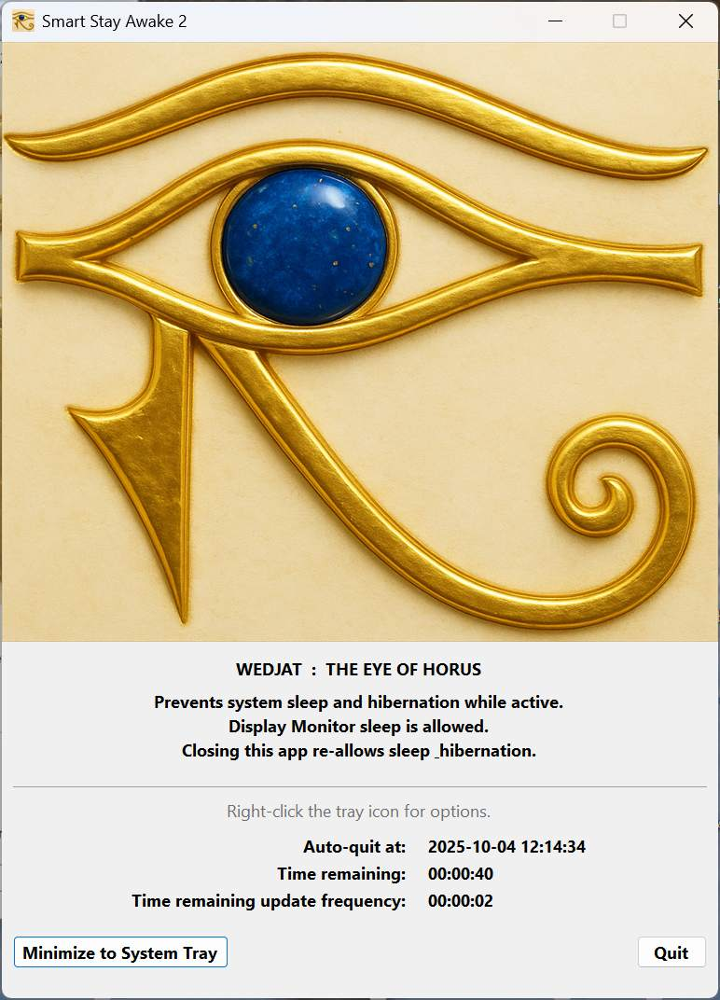

<h1 align="center">
  
  <br>Smart_Stay_Awake_2


</h1>

<!--


Common Statuses


 

Common status labels
active, maintained, stable
alpha, beta, experimental
deprecated, legacy, archived, inactive

Typical named colors
Greens: brightgreen, green, yellowgreen
Yellows/Oranges: yellow, orange
Reds: red, crimson, firebrick
Blues/Purples: blue, navy, blueviolet
Neutrals: lightgrey, grey/gray, black

Semantic: 
success (brightgreen), informational (blue), critical (red), inactive (lightgrey), important (orange) 

How to craft your own
https://img.shields.io/badge/<LABEL>-<MESSAGE>-<COLOR>
Replace <LABEL>, <MESSAGE>, and <COLOR> with whatever text and named color you like. (Spaces become %20)
-->

A lightweight Windows tray utility that keeps your computer **awake** (blocks sleep/hibernation)
while still allowing the **display monitor to sleep**. 

Event-driven architecture means zero CPU polling - the app simply waits for OS timer events to fire,
consuming virtually no resources.

Event-driven architecture means zero CPU polling - the app simply waits for OS timer events to fire,
consuming virtually no resources. Countdown updates execute in sub-millisecond time (<1ms),
delivering responsive UI feedback without performance cost.

---

## What it does

- While Smart\_Stay\_Awake\_2 runs, it requests the OS to **not sleep/hibernate**. Your **display monitor can still sleep** normally if your power plan allows it.
- When you **quit** (or when an **auto-quit** timer fires), the app **releases** the request and your PC can sleep again.
- A small **windows system-tray icon** provides **Show Window** and **Quit**.

---

## Key Features

- **Prevents system sleep/hibernation** while running; auto-restores normal behavior on exit.
- **System tray** icon with a simple menu (Show Window / Quit).
- **Three operating modes:** keep awake indefinitely, or for a fixed duration using `--for` or `--until`
  - **Indefinite:** Runs until you manually quit
  - **For Duration:** Auto-quits the application after a specified time (e.g., 2 hours 90 minutes `2h90m`)
  - **Until Timestamp:** Auto-quits the application at a specific date/time (e.g., `2025-12-31 23:59:59`)
- **Display countdown shown:**
  - **Auto-quit at:** local ETA
  - **Time remaining:** `Xd HH:MM:SS` (days appear when applicable)
  - **Time remaining update frequency:** displays current update frequency for the 'Time remaining'
- **Low-resource-use countdown:** updates window display less often when plenty of time remains; updates faster as it nears zero; and **“snaps”** to neat time boundaries so it feels calm and rounded.
- **Minimize behavior:** both the title-bar **“\_”** and the **Minimize to System Tray** button minimise the app to the system-tray.
- **Close (X)** in the main window exits the app completely.
- **Icon / image priority** (for both the window and tray):
  1. `--icon PATH`** (explicit override)
  2. Embedded base64 in the pythin script which may be empty)
  3. A file named **`Smart_Stay_Awake_icon.*`** next to the EXE/script (PNG/JPG/JPEG/WEBP/BMP/GIF/ICO)
  4. A small internal fallback glyph (so it never crashes)
- **Auto-scaling image:** in the window into a square (by edge replication): longest side <= **512 px** .

---

## User Interface
- **Main window features:**
  - Eye of Horus image display
  - Real-time countdown display (for timed auto-quit modes)
  - Auto-quit timestamp (local time)  (for timed auto-quit modes)
  - Time remaining (formatted as days, hours, minutes, seconds)  (for timed auto-quit modes)
  - Live `Time remaining update frequency` (for timed auto-quit modes)
  - Minimize to system tray button
  - Quit button
- **Window behavior:**
  - Minimize (titlebar `-` button) -> hides to system tray
  - Close (titlebar `X` button) -> exits application completely
  - Minimize to System Tray button -> hides to system tray
- **System tray icon** (when minimised to the windows system tray) using right-click on the icon:
  - Show Window
  - Help
  - Quit
  
<h3 align="left">
  
</h3>

---

## Command-line options

```text
--icon PATH
    Use a specific image file for the window/tray icon.
    Supports: PNG, JPG/JPEG, WEBP, BMP, GIF, ICO.

--for DURATION
    Keep awake for a fixed time, then quit gracefully.
    DURATION accepts days/hours/minutes/seconds in the form of a single string (no spaces):
      3d4h5s, 2h, 90m, 3600s, 1h30m
    A bare number means minutes. Use 0 to disable the timer for maximum duration.
    Bounds: at least MIN_AUTO_QUIT_SECS (default 10s), at most MAX_AUTO_QUIT_SECS (default ~365 days).
    The app re-ceils the remaining time right before arming the timer, for accuracy.
    Mutually exclusive with --until.

--until "YYYY-MM-DD HH:MM:SS"
    DATETIME in the form of a single quoted string, all field parts must be present.
    Keep awake until the given local **24-hour** timestamp, then quit gracefully.
    Examples (relaxed spacing & 1–2 digit parts accepted):
      "2025-01-02 23:22:21"
      "2025- 1- 2  3: 2: 1"
      "2025-1-2 3:2:1"
    Daylight Saving Time and local windows timezone are honored.
    Bounds: at least MIN_AUTO_QUIT_SECS in the future, at most MAX_AUTO_QUIT_SECS from now.
    Mutually exclusive with --for.

--help
    Display this help and stays awake according to the other commandlne parameters.
```

> **Notes**
> * A small (±1s) variation near the very end can occur due to Windows timer jitter - this is normal.

### Basic Usage

**Double-click to run indefinitely:**
```cmd
Smart_Stay_Awake_2.exe
```
The app starts in Indefinite mode and runs until you quit it manually or the system restarts.

**Run for a specific duration:**
```cmd
Smart_Stay_Awake_2.exe --for 2h
Smart_Stay_Awake_2.exe --for 90m
Smart_Stay_Awake_2.exe --for 3d4h30m15s
```

**Run until a specific date/time:**
```cmd
Smart_Stay_Awake_2.exe --until "2025-10-04 23:59:59"
```

### Parameter formats explained

#### `--for <duration>`

Keep the system awake for a fixed duration, then quit gracefully.

**Duration format:**
- Combine days (`d`), hours (`h`), minutes (`m`), and seconds (`s`)
- Examples: `3d`, `2h`, `90m`, `3600s`, `1h30m`, `3d4h5m10s`
- A bare number (no unit) is treated as **minutes**
- Minimum: 10 seconds
- Maximum: ~365 days

**Examples:**
```cmd
Smart_Stay_Awake_2.exe --for 2h          # 2 hours
Smart_Stay_Awake_2.exe --for 45m         # 45 minutes
Smart_Stay_Awake_2.exe --for 90          # 90 minutes (bare number)
Smart_Stay_Awake_2.exe --for 3d4h5s      # 3 days, 4 hours, 5 seconds
```

#### `--until <datetime>`

Keep the system awake until a specific local date/time, then quit gracefully.

**Datetime format:**
- Must be enclosed in quotes
- Format: `"YYYY-MM-DD HH:MM:SS"` (24-hour time)
- Relaxed spacing and 1-2 digit parts are accepted
- Honors local timezone and Daylight Saving Time
- Must be at least 10 seconds in the future
- Must be no more than ~365 days in the future

**Examples:**
```cmd
Smart_Stay_Awake_2.exe --until "2025-10-04 23:30:00"
Smart_Stay_Awake_2.exe --until "2025-12-31 23:59:59"
Smart_Stay_Awake_2.exe --until "2025-1-2 3:2:1"        # Relaxed format
```

#### Mutual Exclusivity

**`--for` and `--until` are mutually exclusive.** Provide only one or the other, not both.

---

## Smart Auto-quit timer and Time remaining update frequency
- **Countdown to Auto-quit** shows ETA for Auto-quit and a time remaining countdown
- **Adaptive time remaining update frequency** that balances accuracy with CPU resource usage
- **Smooth time boundary snapping** for a cleaner easier-to-read display
- **Monotonic deadline tracking** to prevent timer drift

| Time remaining update frequency | Update Frequency | Reason |
|----------------|------------------|--------|
| **> 60 minutes** | Every **10 minutes** | Far from deadline; high precision not needed |
| **30 to 60 minutes** | Every **5 minutes** | Distant deadline; minimal updates conserve resources |
| **15 to 30 minutes** | Every **1 minute** | Approaching deadline; moderate precision |
| **10 to 15 minutes** | Every **30 seconds** | Getting closer; increased update rate |
| **5 to 10 minutes** | Every **15 seconds** | Close to deadline; higher precision needed |
| **2 to 5 minutes** | Every **10 seconds** | Very close; frequent updates for accuracy |
| **1 to 2 minutes** | Every **5 seconds** | Almost there; high-frequency updates |
| **30 seconds to 1 minute** | Every **2 seconds** | Final approach; near real-time updates |
| **<= 30 seconds** | Every **1 second** | Final countdown |

---

## Visibility in Power Management queries
When Smart Stay Awake 2 is running, the Windows (Admin) command `powercfg /requests` shows, for example:
```
SYSTEM:
[PROCESS] \Device\HarddiskVolume3\Path\To\Smart_Stay_Awake_2.exe
Smart Stay Awake 2: Preventing automatic sleep & hibernation (display monitor may sleep) as requested (auto-quit at 2025-10-04 15:30:00).
```

This ensures that IT administrators and Admin/Power users can see exactly what's preventing system hibernation and sleep and when it will release.

---

## Requirements

### Supported Operating System
- **Windows 10** version 2004 (May 2020 Update) or later
- **Windows 11** (all versions)

To check your Windows version:
1. Press `Win + R`
2. Type `winver` and press Enter
3. Look for "Version 2004" or higher

### Runtime
- **Microtosft .NET 8+ Desktop Runtime** (x64)
  - Ask your system administrator, this is a 'normal' thing to have on any PC ...
  - Download: [https://dotnet.microsoft.com/download/dotnet/8.0](https://dotnet.microsoft.com/download/dotnet/8.0)
  - The installer will prompt you if the runtime is missing

### Permissions to run
- **No administrator rights required** for normal operation
- Standard user permissions are sufficient

---

## Download & Installation

1. Download the latest release ZIP from the [Releases](../../releases) page
2. Extract all files to a folder of your choice:
   - `Smart_Stay_Awake_2.exe`
   - `Microsoft.Windows.CsWin32.dll`
   - `System.Memory.dll`
   - `System.Runtime.CompilerServices.Unsafe.dll`
   - `Microsoft.Bcl.AsyncInterfaces.dll`
   - `Assets/` folder (contains icon resources)
   - etc
3. **Keep all extracted files together** in the same folder
4. Run `Smart_Stay_Awake_2.exe` as described under **Basic Usage** above.

**Important:** All items (exe + DLLs + Assets folder) **must** remain in the same directory
for the application to work.

> Apparently Microsoft's idea of a C# *standalone .exe* includes keeping .DLL files etc in the same folder with the .exe.

---

## Building it yourself (BIY) from Source

### Prerequisites

1. **Visual Studio 2022** (Community Edition or higher)
   - Workload: ".NET Desktop Development"
   - Component: ".NET 8 SDK"
2. **Git** (for cloning the repository)

### Build Steps

**Clone the repository:**
```cmd
git clone https://github.com/yourusername/Smart_Stay_Awake_2.git
cd Smart_Stay_Awake_2
```

**Open in Visual Studio:**
```cmd
start Smart_Stay_Awake_2.sln
```

**Restore NuGet packages:**
Visual Studio will automatically restore packages on first build. Packages include:
- `Microsoft.Windows.CsWin32`
- Supporting libraries for CsWin32

**Build it in the usual way:**    
- You will need to learn to use Visual Studio.    
- ClaudeAI or ChatGPT can help with that, leading you through the steps.

> The `solution` targets only x64 (of course).    
> There's an inbuilt image (jpg) and and icon (jpg), both in base64 format (~3Mb), one of the AIs can help you replace them with others if you want.


### Acknowledgments

- Built with [.NET 8](https://dotnet.microsoft.com/) and [Windows Forms](https://docs.microsoft.com/en-us/dotnet/desktop/winforms/)
- Windows API bindings generated by [CsWin32](https://github.com/microsoft/CsWin32)
- Icon inspired by the ancient Egyptian Eye of Horus (Wadjet)
- ClaudeAI and ChatGPT AI for providing learning and assistance

### Additional Resources

- [Windows Power Management API Documentation](https://docs.microsoft.com/en-us/windows/win32/power/power-management-portal)
- [CsWin32 GitHub Repository](https://github.com/microsoft/CsWin32)
- [.NET 8 Documentation](https://docs.microsoft.com/en-us/dotnet/core/whats-new/dotnet-8)
- [Windows Forms Documentation](https://docs.microsoft.com/en-us/dotnet/desktop/winforms/)

### License Summary

This project is licensed under the **GNU Affero General Public License v3.0 (AGPL-3.0)**.    

For a human-readable summary of the AGPL-3.0 license
see [choosealicense.com/licenses/agpl-3.0](https://choosealicense.com/licenses/agpl-3.0/).


**Why AGPL-3.0?**

The AGPL-3.0 license ensures that improvements and modifications to this application
remain open source and benefit the community, even when used in network/server environments.

---

## Troubleshooting

### Common Issues

**Application won't start:**
- Ensure all 7 items are in the same folder (exe + 5 DLLs + Assets folder)
- Verify Windows 10 version 2004+ (run `winver` to check)
- Try running from Command Prompt to see error messages:
  ```cmd
  cd C:\Path\To\Smart_Stay_Awake_2
  Smart_Stay_Awake_2.exe
  ```

**No tray icon appears:**
- Check the system tray overflow area (click the `^` arrow)
- Enable "Always show all icons in the taskbar" in Windows settings:
  1. Right-click taskbar → Taskbar settings
  2. Scroll to "System tray" → "Select which icons appear on the taskbar"
  3. Enable Smart_Stay_Awake_2 or toggle "Always show all icons"

**System still sleeps:**
- Verify the app is running: Check `powercfg /requests` in Command Prompt
  ```cmd
  powercfg /requests
  ```
  You should see Smart Stay Awake 2 listed under "SYSTEM"
- Another power policy or OEM tool may override system requests
- Some laptops have hardware sleep buttons that bypass software blocks
- Check Windows power plan advanced settings for conflicting policies

**Auto-quit timer didn't fire exactly on time:**
- Minor drift (±1 second) is normal due to Windows scheduler granularity
- The app uses monotonic timers to maintain accuracy over long durations
- If the timer is off by more than 2-3 seconds, please file a bug report

**SmartScreen or antivirus blocks the exe:**
- Unsigned binaries may trigger SmartScreen on first run
- Click "More info → Run anyway" after reviewing the source code yourself
- Add an exclusion in Windows Defender if you trust the application
- Submit false positive reports to Microsoft to improve reputation

**Want more detailed logging:**
- The application writes trace logs to the Windows Event Viewer (Application log)
- You can also run the app from Command Prompt with debug output:
  ```cmd
  Smart_Stay_Awake_2.exe --verbose
  ```
  (if --verbose mode is implemented in your version)

### Verifying Power Request Status

To confirm the app is working:

**Open Command Prompt or PowerShell as an Admin:**
```cmd
powercfg /requests
```

**Look for output like:**
```
SYSTEM:
[PROCESS] \Device\HarddiskVolume3\Path\To\Smart_Stay_Awake_2.exe
Smart Stay Awake 2: Preventing automatic sleep & hibernation (display monitor may sleep) as requested (indefinitely).
```
or
```
SYSTEM:
[PROCESS] \Device\HarddiskVolume3\Path\To\Smart_Stay_Awake_2.exe
Smart Stay Awake 2: Preventing automatic sleep & hibernation (display monitor may sleep) as requested (auto-quit a yyyy-MM-dd hh:mm:ss ).
```

If you see this, a power request is active and working correctly.

---

## Tech stuff

### Key Technologies

- **.NET 8** (Windows Desktop Framework)
- **Windows Forms** (UI framework)
- **Visual Studio** (to build the application)
- **CsWin32** (source-generated P/Invoke bindings)
  - Generates type-safe Windows API calls from metadata
  - No manual P/Invoke declarations needed
- **Windows Power Request API**
  - `PowerCreateRequest()`
  - `PowerSetRequest()`
  - `PowerClearRequest()`
  - `CloseHandle()`

### Design Patterns

- **Singleton pattern** for `PowerRequestManager` (ensures only one active power request)
- **Dispose pattern** for proper cleanup of native resources (power request handles)
- **MVC-style separation** between UI (`MainForm`), state (`AppState`), and business logic (`PowerRequestManager`)
- **Immutable configuration** via `AppState` to prevent accidental state corruption

---

## The EYE OF HORUS

<p align="center">
  <em>The ancient Egyptian "Eye of Horus" (aka "Wadjet") is a symbol of protection, healing, and restoration—an eye that, metaphorically, never sleeps.</em>
</p>

---

